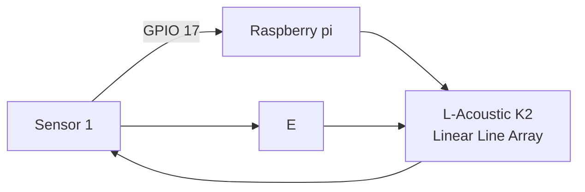
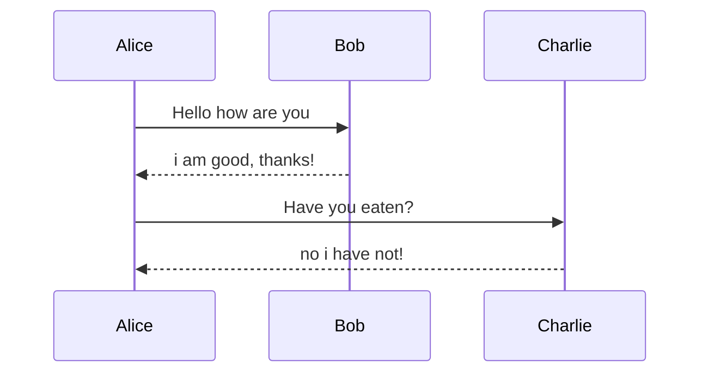

# HEADERS
This is for **heading 1**.

## heading 2
This is for *heading 2*.

### heading 3
This is for ***Heading 3***.

# LIST
this is how you list items in markdown.
1. member 1
    * team leader
        * project owner
2. member2
    * hardware
2. member3
    * software
2. member4
    * cheerleader

# INSERTING IMAGE

To insert an image, you will need to drag + hold shift + drop


[Click here to link](https://www.google.com)

[Click here to jump to test.md](/Test/Test.md)


# CODE BLOCK

To highlight or insert a particular section of code, you can do the following

1. In raspberry pi, if you want to update you will `sudo apt update`

```
from tkinter import *

main = Tk()

main.mainloop()
```

# QUOTES

A famous quote by **Sir Isaac Newton**
> for every action, there will be a reation.

# TABLES

This is how you insert tables

|Header A|Header B|Header C|
|----------:|----:|:----|
|Row 1| Data A| Data B|
|Row 2| Data C| Data D| 

```
|----:| this is to justify right
```

# HORIZONTAL RULE

This is how to insert a section line

---


# FLOWCHART



# SEQUENCE DIAGRAM



